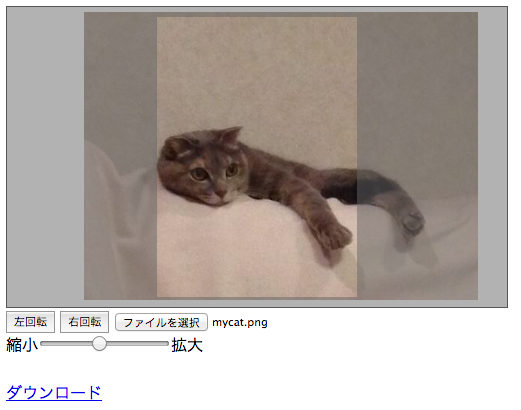

# ImageCropperJS



ブラウザ上で画像を切り取ってダウンロードやアップロードをさせるライブラリ  
[Demo - Example of ImageCropperJS](https://asakura-dev.github.io/ImageCropperJS/ "DEMO - Example of ImageCropperJS")

## 使い方
### JavaScript/CSSファイルの読み込み

```html:index.html
<head>
  <!-- 必要となるファイル -->
  <script src="https://ajax.googleapis.com/ajax/libs/jquery/2.1.3/jquery.min.js"></script>
  <script src="./image-cropper.js"></script>
  <link rel="stylesheet" type="text/css" href="./image-cropper.css" media="screen">
  <!-- オプション設定用のJavaScript  -->
  <script src="./main.js"></script>
</head>
```

### ImageCroppeを埋め込む

```html:index.html
<body>
  <div class="crop-container"><!-- ここに編集画面が追加されます --></div>
  
  <!-- 操作用のボタンを追加 -->
  <!-- ・回転用 -->
  <button id="rotateLeft">左回転</button>
  <button id="rotateRight">右回転</button>
  <!-- ・ファイルの選択 -->
  <input type="file" id="loadFile"><br>
  <!-- ・拡大縮小 -->
  縮小<input type="range" max="100" min="0" id="zoom">拡大
  <br><br>
  
  <!-- ・ダウンロードさせたい時 -->
  <a href="" download="image.png" id="download_canvas_image">ダウンロード</a>
  <!-- ・サーバーにアップロードさせたい時
        base64エンコードされた値がvalue=""に埋めこまれます
        サーバー側でデコードする必要があります
  -->
  <input type="hidden" id="image_input">
</body>
```

### ImageCropperの初期化・カスタマイズ

```JavaScript:main.js
$(function(){
  var cropper = $.imageCropper.new(".crop-container",{
  /* 編集画面の大きさ */
    canvas : {
      width : "500px",
      height : "300px"
    },
    /* 切り取る画像の大きさ */
    crop : {
      width : "200px",
      height : "280px",
    }
  });
   
  /* 操作ボタンと実際の操作を紐つける */
  cropper.attach({
    load: "#loadFile",
    rotateRight: "#rotateRight",
    rotateLeft : "#rotateLeft",
    zoom : "#zoom",
    output: "#download_canvas_image"
  });
});
```

## 依存
- jQuery 2.0~

## 動作環境
- Canvasが動作する環境
- toDataURLがサポートされているブラウザ

## ライセンス
MITライセンス